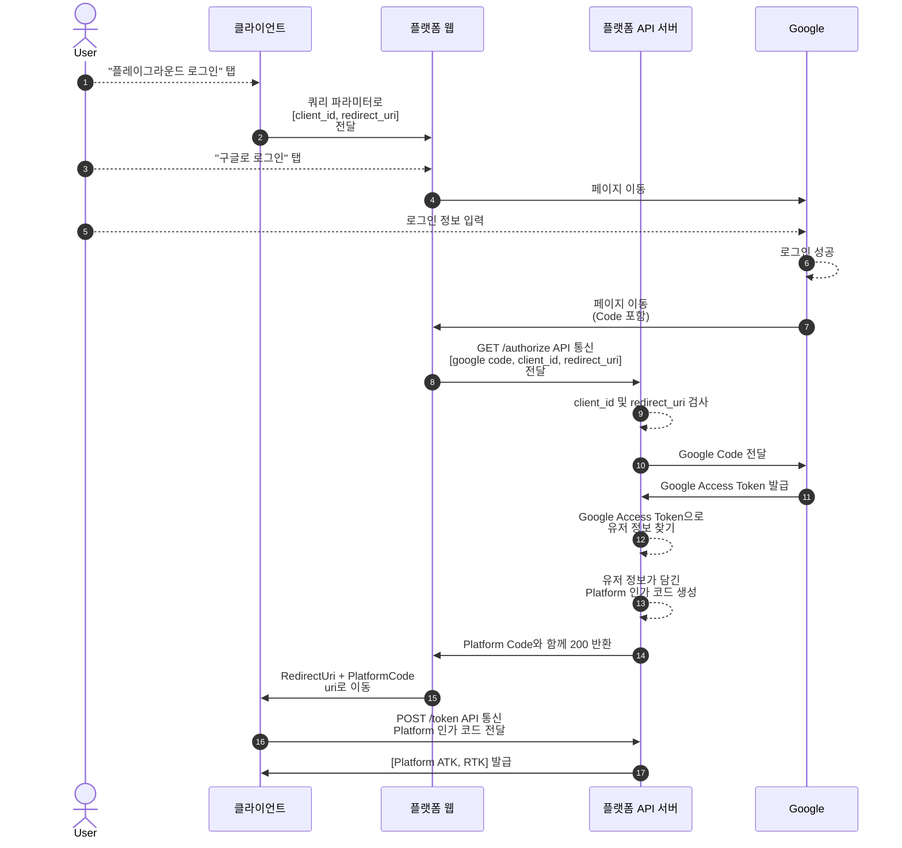

### 개요

---

메이커스 내의 인증을 분리하기 전, SSO 플로우가 잘 동작하는지 간단한 PoC를 만들어서 테스트하려 한다.

https://github.com/KWY0218/Makers-Auth-PoC/assets/82709044/a1ae6f7a-60c2-4e48-a098-3cd4178b20da

**`Client-Web` [ localhost:3001 ]**

- 클라이언트 역할을 담당하며, 플랫폼 인증 기능을 사용한다.

**`Platform-Web` [ localhost:3000 ]**

- OAuth 프로토콜의 user-agent 역할을 담당한다.

**`Platform-Back` [ localhost:8080 ]**

- Resource 서버로 클라이언트에게 ATK, RTK를 반환하는 역할을 담당한다.

### 흐름
---

### 순서

---

1. **클라이언트**는 `플레이그라운드 로그인` 버튼을 클릭시 user-agent 역할을 담당하는 **플랫폼 웹뷰**로 이동한다. 이때, 클라이언트의 `clientId` , `redirectUri` 를 Query parameter로 넘긴다.

2. **플랫폼 웹뷰**는 소셜로그인(애플 또는 구글)을 진행한 결과로 받은 `소셜 인가 코드` 와 클라이언트에게 전달 받은 `clientId` , `redirectUri` 를 GET /authorize API를 통해 **플랫폼 서버**에게 전달한다.

    ex) `http://localhost:8080/authorize?code=${SocialCode}&clientId=${clientId}&redirectUri=${redirectUri}`

3. **플랫폼 서버**는 **플랫폼 웹뷰**로 부터 받은 값을 검증한다.
    - `소셜 인가 코드` → `소셜 리소스 서버` 를 통해 검증
    - `clientId` , `redirectUri` → 사전에 등록된 클라이언트인지 검증

4. **플랫폼 서버**는 검증에 문제가 없을 시, 200 응답과 함께 `플랫폼 인가 코드` 를 **플랫폼 웹뷰**로 전달한다.

5. **플랫폼 웹뷰**는 로컬에 저장되어 있는 `redirectUri` 뒤에 Query parameter로 `플랫폼 인가 코드` 를 덧붙인 뒤 **클라이언트**로 리다이렉션을 한다.

6. **클라이언트**는 리다이렉션 된 화면에서 `플랫폼 인가 코드` , `clientId` , `redirectUri` , `grantType` 을 POST /token API를 통해 **플랫폼 서버**에게 전달한다.

7. **플랫폼 서버**는 **클라이언트**로부터 받은 값을 검증한 뒤, 문제가 없을 시 ATK와 RTK를 반환한다.

8. **클라이언트**는 ATK와 RTK를 반환 받은 뒤, 로컬 스토리지에 저장하고 메인 화면으로 이동한다.
